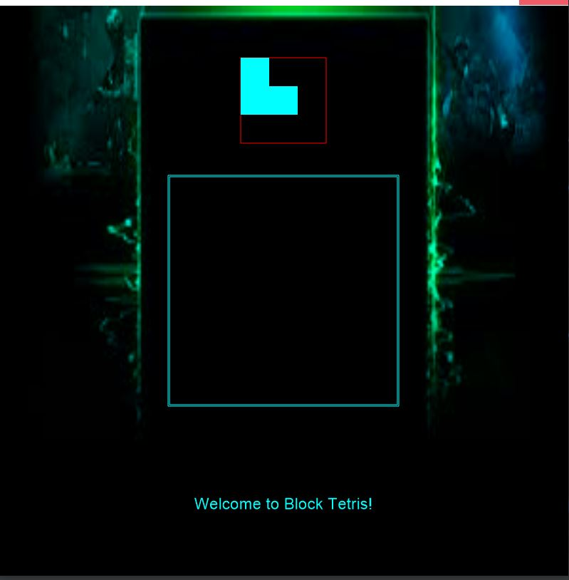

# Final Project

# Enhanced Tetris

Author: Nikil Ravi

# Overview

This project is meant to be an enhanced version of the popular, yet simple, Tetris game. Tetris involves falling blocks that have to be placed in the optimal orientation possible. This project is meant to be a cross between Tetris and a typical jigsaw puzzle.

The game will be somewhat like Tetris, but will have some modifications- for instance, instead of having the blocks just falling/moving downwards, the blocks will simply appear on the screen, and the user will be able to drag and place them in the main 'tetris area', like in the [Block Puzzle](https://play.google.com/store/apps/details?id=game.puzzle.blockpuzzle&hl=en_US) game on PlayStore.

The project uses Cinder with OpenGL.

To use this project, you must have Visual Studio 2015 on Windows. It also uses CMake as a build tool; once you have these configured properly, all you need to do is build and run the repository after cloning it.

Here are the steps (preferably on Windows):

1) Install Visual Studio 2015 by following the steps here: 

2) Get Cinder: You can download the latest version Cinder for your platform here.
Here is a basic tutorial on how to develop Cinder projects: https://libcinder.org/docs/guides/tour/hello_cinder_chapter1.html.
Some helpful documentation: https://libcinder.org/docs/reference/index.html.

3) Here are the steps to get started with Cinder in your IDE:
- Download Cinder (v0.9.2) for your platform and extract the downloaded item into a folder, say ~/Cinder.
- Open the ~/Cinder folder in CLion and click the green build button. This will build libcinder.
- Create a directory, say my-projects in ~/Cinder. Clone the 'Enhanced Tetris' project into this folder.
- Open the 'Enhanced Tetris' project in CLion. Then, set the target to cinder-tetris and click the run button.

